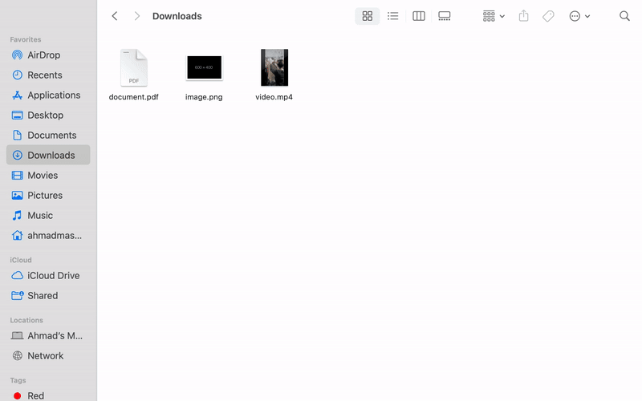

# File Sorter Application


## Description
The File Sorter Application is a Python-based tool designed to help organize files in a directory. It automatically sorts files into subdirectories based on chosen criteria: file size, file type, or date modified.

## Features
- **Sort by Size**: Organizes files into 'Small', 'Medium', or 'Large' subdirectories based on their size.
- **Sort by Type**: Sorts files into subdirectories named after their file extensions.
- **Sort by Date**: Arranges files into subdirectories named by their last modified date in 'YYYY-MM-DD' format.

## Installation
This application requires Python to be installed on your system. [Download Python](https://www.python.org/downloads/).

After installing Python, download or clone this repository to your local machine. Navigate to the downloaded directory in your command line interface.

## Usage
Run the application by executing the `main.py` script:

```bash
python main.py
```

Follow the on-screen prompts to choose the directory you wish to organize and the sorting criteria.

## Dependencies
- Python 3.x
- No external libraries are required for the basic functionality.

## Contributing
Contributions to the File Sorter Application are welcome. Feel free to fork the repository and submit pull requests.

## License
[MIT License](LICENSE.md) - feel free to use and modify this application as you see fit.
